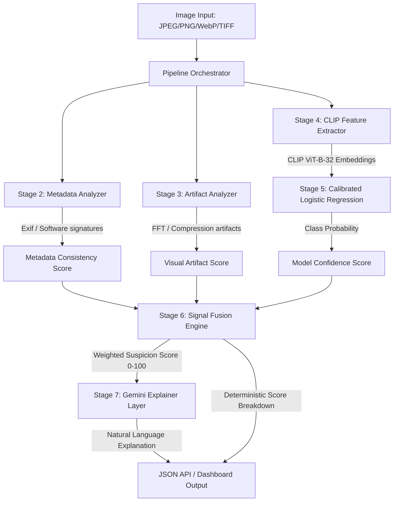

# DeepMediaCheck: AI-Generated Content Detection System


[](https://huggingface.co/spaces/AshishFatke2520/DeepMediaCheck)


## 📌 Overview

**DeepMediaCheck** is a modular, transparent, and explainable AI detection system designed to identify synthetic (AI-generated) images. Unlike black-box classifiers, this system employs a **multi-signal fusion approach**, combining metadata consistency checks, visual artifact analysis (compression/frequency), and semantic anomaly detection (via CLIP embeddings).

The core philosophy is **Explainable AI (XAI)**. The system doesn't just say "Fake"; it explains *why* (e.g., "Inconsistent Exif data," "High-frequency noise anomalies," "Semantic features match generator signatures").

---

## 🚀 Key Features

*   **Multi-Modal Analysis**:
    *   **Metadata Forensics**: Checks for missing Exif, software signature mismatches (e.g., Photoshop vs. Camera), and temporal inconsistencies.
    *   **Visual Artifacts**: Analyzes JPEG quantization tables, double compression traces, and FFT frequency anomalies.
    *   **Semantic Detection**: Uses **CLIP (Contrastive Language-Image Pre-training)** embeddings to detect high-level semantic patterns characteristic of generative models.
*   **Signal Fusion Engine**: Deterministically aggregates diverse signals using configurable weights and handles conflicting evidence.
*   **LLM-Powered Explanations**: Integrates with **Google Gemini 1.5 Flash** to generate natural language summaries of the findings for non-technical users.
*   **Production-Ready API**: Built with FastAPI, featuring structured Pydantic schemas, JWT authentication, history tracking, and comprehensive validation.
*   **Interactive Frontend Dashboard**: Built with React + Vite, allowing users to register/login, drag-and-drop images for analysis, visualize detailed signal breakdowns, and review historical checks.

---

## 🛠️ Architecture & Data Flow



---

## 📂 Project Structure

```text
DeepMediaCheck/
├── app/                  # FastAPI backend application
│   ├── api/              # API router and endpoints (V1)
│   ├── core/             # Core logic & services (classifiers, fusion, Gemini explainer, DB)
│   └── schemas/          # Pydantic schemas for request/response validation
├── data/                 # Local data storage (dataset, processed features, trained models)
├── frontend/             # React + Vite frontend dashboard
│   ├── src/              # React components, pages, context, and services
│   └── index.html        # Frontend entry point
├── scripts/              # Data prep, classifier training, and evaluation scripts
│   └── deploy/           # Deployment automation (.bat scripts, local run scripts)
├── tests/                # System stage verification scripts
├── requirements.txt      # Python dependencies
└── README.md             # Project documentation
```

---

## 📦 Tech Stack

*   **Backend**: Python 3.10+, FastAPI, Uvicorn, Motor (MongoDB Async driver)
*   **Database**: MongoDB (user authentication & history storage)
*   **Computer Vision**: OpenCV, Pillow, NumPy, SciPy
*   **Machine Learning**: PyTorch, OpenCLIP, Scikit-Learn (Calibrated Logistic Regression with Platt Scaling)
*   **LLM Explanation**: Google Generative AI (Gemini 1.5 Flash)
*   **Frontend**: React 18+, Vite, Axios, React Router, CSS Variables

---

## ⚡ Installation & Setup

### Prerequisites
1. **Python 3.10+**
2. **Node.js (v18+) & npm**
3. **MongoDB** (running locally on port 27017 or remote URI)

### 1. Clone the Repository
```bash
git clone https://github.com/<your-username>/DeepMediaCheck.git
cd DeepMediaCheck
```

### 2. Backend Setup
1. **Initialize Environment**
   ```bash
   # Windows (Automatic virtual env & installation)
   scripts\deploy\setup_env.bat
   ```
   *Alternatively, set up manually:*
   ```bash
   python -m venv venv
   # Windows
   venv\Scripts\activate
   # Linux/macOS
   source venv/bin/activate

   pip install -r requirements.txt
   ```

2. **Configure Environment Variables**
   * Copy `.env.example` to `.env` in the root directory.
   * Add your `GEMINI_API_KEY` (from [Google AI Studio](https://aistudio.google.com/)) and set `ENABLE_LLM_EXPLANATIONS=True` if you wish to use the explanation layer.
   * Update `MONGO_URI` if your MongoDB server is running on a custom port or remote server.

3. **Start the API Server**
   ```bash
   scripts\deploy\start_local.bat
   # Or manually:
   uvicorn app.main:app --reload
   ```
   * The API docs will be available at: [http://127.0.0.1:8000/docs](http://127.0.0.1:8000/docs)

### 3. Frontend Setup
1. **Install Frontend Dependencies**
   ```bash
   cd frontend
   npm install
   ```
2. **Start the Dev Server**
   ```bash
   npm run dev
   ```
   * The dashboard will be accessible at: [http://localhost:5173](http://localhost:5173)

---

## 🏃 Usage

### Running the CLI Demo
You can run a local verification check on any image file using the CLI demo:
```bash
python scripts/deploy/run_demo.py --image path/to/your/image.jpg
```

### API Endpoints
All API routes are prefixed by `/api/v1`. Endpoints requiring authentication need a `Bearer <JWT_TOKEN>` header.

| Method | Endpoint | Auth | Description |
| :--- | :--- | :---: | :--- |
| **GET** | `/health` | No | Health check, system version, & status |
| **POST** | `/auth/register` | No | Register a new user |
| **POST** | `/auth/login` | No | Login and receive JWT access token |
| **POST** | `/analyze/metadata` | Yes | Extract Exif & analyze metadata consistency |
| **POST** | `/analyze/artifacts` | No | Analyze JPEG compression & FFT frequency artifacts |
| **POST** | `/analyze/features` | No | Extract `ViT-B-32` CLIP feature embeddings |
| **POST** | `/analyze/fusion` | No | Orchestrated pipeline with optional Gemini 1.5 Flash explanations (query `explain=true`) |
| **GET** | `/history/` | Yes | Retrieve user analysis search history |
| **DELETE** | `/history/` | Yes | Clear user search history |

---

## 🧠 Model Training & Evaluation

To train the Stage 5 Classifier on custom data:

1.  **Prepare Data**: Organize your training images into `data/dataset/real` and `data/dataset/fake`.
2.  **Extract Embeddings**:
    ```bash
    python scripts/prepare_dataset.py --data_dir data/dataset --output_dir data/processed
    ```
3.  **Train the Calibrated Classifier**:
    ```bash
    python scripts/train_classifier.py --data_dir data/processed
    ```
4.  **Run Evaluation Suite**:
    ```bash
    python scripts/run_evaluation.py --data_dir data/dataset/test
    ```

---

## 🧪 Running Verification Tests
To verify that each stage of the pipeline is functioning correctly, you can run the localized integration tests:
```bash
# Verify Stage 2: Metadata Analyzer
python tests/stage2_verify.py

# Verify Stage 3: Artifact Analyzer
python tests/verify_stage3.py

# Verify Stage 4: CLIP Embedding Extractor
python tests/verify_stage4.py

# Verify Stage 6: Signal Fusion Engine
python tests/verify_stage6.py

# Verify Stage 7: Gemini Explainer Layer
python tests/verify_stage7.py
```

---

## ⚠️ Limitations & Ethics

*   **Not a Silver Bullet**: No detector is 100% accurate. This tool is a decision-support aid, not an absolute arbiter.
*   **Data Bias**: The classifier's performance depends heavily on the diversity of the training set. A classifier trained on Stable Diffusion 1.5 may experience degraded performance against newer architectures like Midjourney v6 or Flux unless calibrated.
*   **Adversarial Robustness**: Generative model outputs can be manipulated (e.g., via slight Gaussian blur, resizing, or JPEG re-compression) to evade detection.
*   **False Positives**: Heavily edited authentic photos (e.g., complex digital paintings or highly filtered social media images) may trigger pixel artifact thresholds.

---

## 🗺️ Roadmap

*   [ ] Stage 9: Docker Deployment (Containerizing backend and frontend)
*   [x] Stage 10: Frontend Dashboard (Vite/React integration with local DB history)
*   [ ] Support for Video Analysis (Frame extraction pipeline)
*   [ ] Audio Analysis Integration

---

## 💼 For Recruiters / Technical Reviewers

This project demonstrates my ability to build **end-to-end Machine Learning systems**, moving beyond basic Jupyter notebook scripts to a robust, modular, and fully architected production application.

**Key Engineering Challenges Solved:**
1.  **System Optimization**: Resolved startup latencies of heavy deep learning models (PyTorch CLIP) via **Lazy Loading** design patterns, ensuring the FastAPI server responds instantaneously to health probes.
2.  **Signal Fusion Engine**: Avoided typical black-box classifications. I designed a deterministic aggregation engine that weights metadata, structural, and semantic signals, handles conflicting inputs, and mathematically derives a final confidence score.
3.  **Explainability (XAI)**: Leveraged Google Gemini 1.5 Flash strictly as a **communication layer**, translating mathematical scores and anomalies into intuitive natural language explanations, while completely preventing metric hallucination.
4.  **Full-Stack Security & State**: Built custom JWT authentication, secure password hashing, and persistent transaction history storing MongoDB records, fully integrated with a modern React SPA.

---

**License**: MIT
